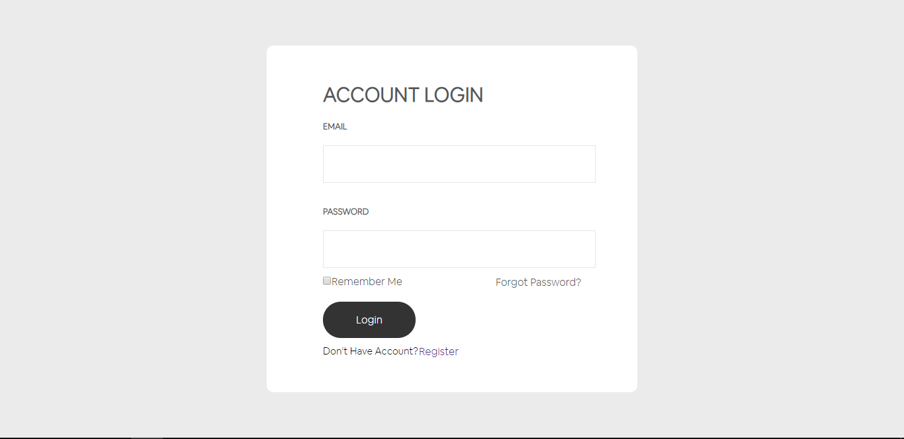
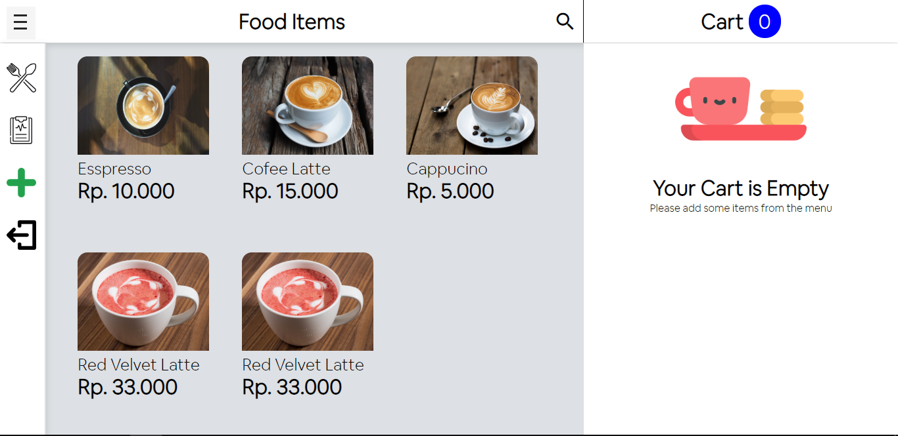
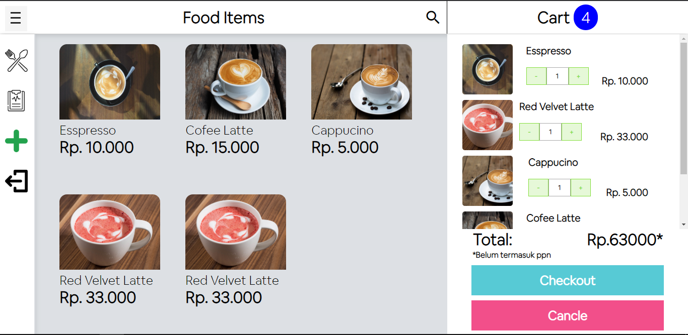
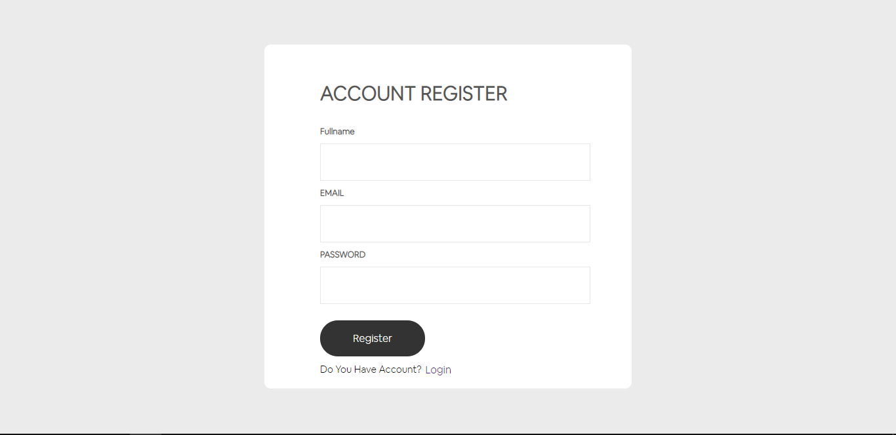
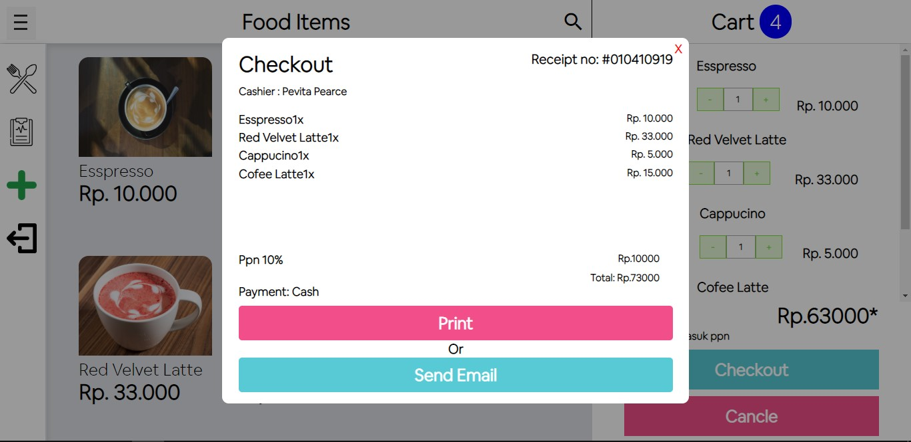

# Food Cashier (POS)


<p align="center">
  
</p>
<p align="center">
  Built with Vue Js.
</p>


## Table of Contents

- [Features](#Features)
- [How To Install](#how-to-install)
- [Related Project](#related-project)
- [Screenshot](#Screenshot)
- [Contact](#contact)

## Features

- Users who are not logged in can only view the Menu
- Users must sign up and sign in to make a transaction
- And others


## How-To-Install

1. Open your terminal or command prompt
2. Type `git clone https://github.com/bagakibadi/FoodCashierVue.git`
3. Open the folder and type `npm install` for install dependencies
4. Create Environment Variable [here](#create-environment-variable)
5. Before run this, you must run [Backend First](#related-project)
6. Type `npm run serve` for run this app.

## Create Environment Variable

```
$ touch .env.local
$ nano .env.local
```

```
VUE_APP_API=YOUR_URL_API
VUE_APP_SECRET_KEY=YOUR_SECRET_KEY
```

## Related Project

* [`Backend-Food-Cashier`](https://github.com/bagakibadi/Backend-FoodCashier)

## Screenshot

<div align="center">
    
    
    
    
    
</div>


## Contact

MyEmail : solaybagus2@gmail.com
